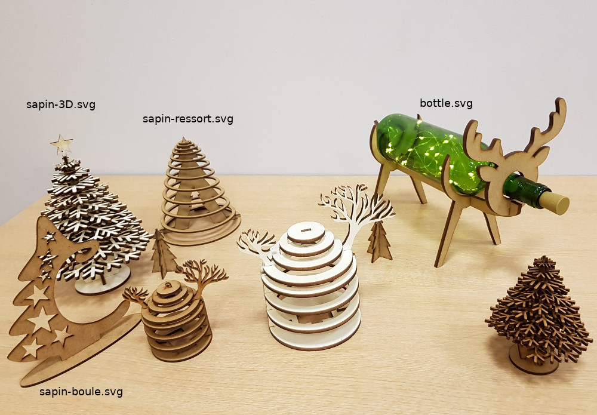
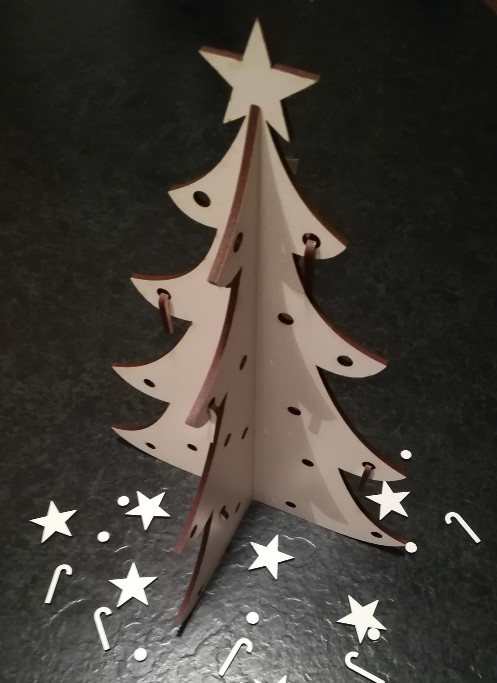

Décorations de Noël
===================

**Auteur**: Fablab

**License**: CC-NC-BY-SA

**Sujet**: Boules de Noël

**Mots clefs**: noel, boule

**Matériel**

Détails
--------

Différents modèles pour Noël :
- Boules de noël à accrocher sur le sapin.
- Porte bouteille renne (fichiers bottle*).
- Sapin de Noël 3D (fichiers sapin-3D*).
- Sapin de Noël ressort (fichiers sapin-ressort.*).
- Sapin pour accrocher une boule de Noël (fichiers sapin-boule.*).
- Sapin de Noël à emboîter et sa déco (fichiers sapin_noel_et_deco.*)

Photos > Pictures
------

